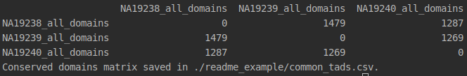
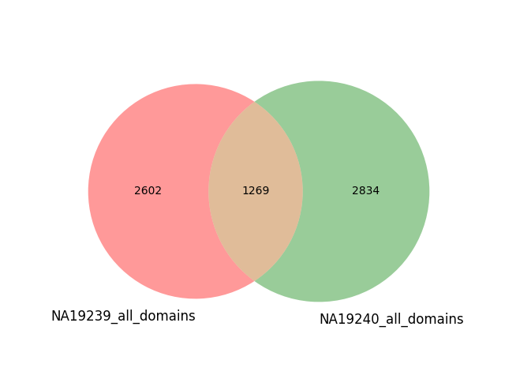
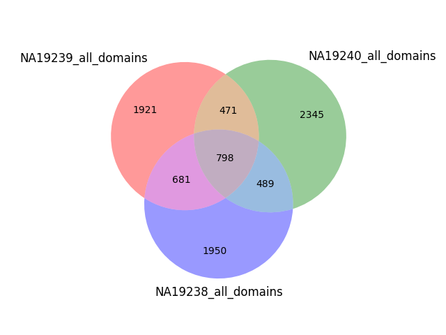

# tad_compare

Is a python library to compare different sets of TADs (or CCDs) inferred from 3D genomic data (Hi-C, ChIA-PET or other 3C techniques).

It's still under development, current version supports comparing multiple different sets of TADs saved in separate .bed files.

BED file format requires information about chromosome in first column and about TAD start and end in second and third column respectively. Other columns are ignored at this stage. 

EXAMPLE:

chr1	40000	200000  
chr1	880000	1320000  
chr1	1920000	2400000  
chr1	2400000	2480000  
chr1	2760000	3440000  
....

## Measure of Concordance (MoC)
Parameteres:  

  -h, --help            show this help message and exit  
  -a BEDFILE_1, --bedfile_1  Bedfile with first set of domains or path to multiple domains files.  
  -b BEDFILE_2, --bedfile_2  Bedfile with second set of domains. Used only if --bedfile_1 is not a directory.  
  -o OUTPUT, --output
                        Directory to save output file. Output is saved only
                        when analysing multiple sets of TADs (When --bedfile_1
                        is a directory). If None save in input directory.  
  -r REPORT, --report
                        If True return MoC to stdout. Default=True
 

### Comparing two sets:
Usage:

`./moc.py -a domains_to_compare/NA19238_all_domains.bed -b domains_to_compare/NA19239_all_domains.bed`

Output:

`Number of domains in NA19238_all_domains: 3918`  
`Number of domains in NA19239_all_domains: 3871`  
`MoC for NA19238_all_domains and NA19239_all_domains equals to: 0.847649147998292`

### Comparing multiple sets:

Usage:

`./moc.py -a ~/domains_to_compare/ -o output.csv -r True`

Output:

Measure of Concordance is implemented according to formula proposed in:  

Zufferey, Marie, et al. "Comparison of computational methods for the identification of topologically associating domains." Genome biology 19.1 (2018): 217.

## Conserved domains

Parameteres:  

  -h, --help            show this help message and exit  
  -a BEDFILE_1, --bedfile_1  Bedfile with first set of domains or path to multiple domains files.  
  -b BEDFILE_2, --bedfile_2  Bedfile with second set of domains. Used only if --bedfile_1 is not a directory.   
  -o OUTPUT, --output  Directory to save output file. Output is saved only
                        when analysing multiple sets of TADs (When --bedfile_1
                        is a directory. If None save in input directory.  
  -r  REPORT, --report If True print output matrix to stdout. Default=True  
  -s SHIFT, --shift 
                        Accepted shift of two domain boundaries positions in
                        base pair.  

### Comparing two sets:
Usage:  

` ./common_tads.py -a NA19238_all_domains.bed -b NA19240_all_domains.bed`

Output:  

`Number of common TADs between NA19238_all_domains and NA19240_all_domains with shift 0 bp equals to: 1287.'`
### Comparing multiple sets:
Usage:

` ./common_tads.py -a ~/domains/yoruba/ -o ./readme_example/common_tads.csv -r True -s 0`

Output:

## Venn diagram

Plot Venn diagram of TADs shared among either two or three different sets.

### Two sets:

Usage:
`./plot_venn.py -d NA19239_all_domains.bed NA19240_all_domains.bed -o ./readme_example/venn_2_sets.png`

Output:

### Three sets:

Usage:

`./plot_venn.py -d NA19239_all_domains.bed NA19240_all_domains.bed NA19238_all_domains.bed -o ./readme_example/venn_3_sets.png
`

Output:

